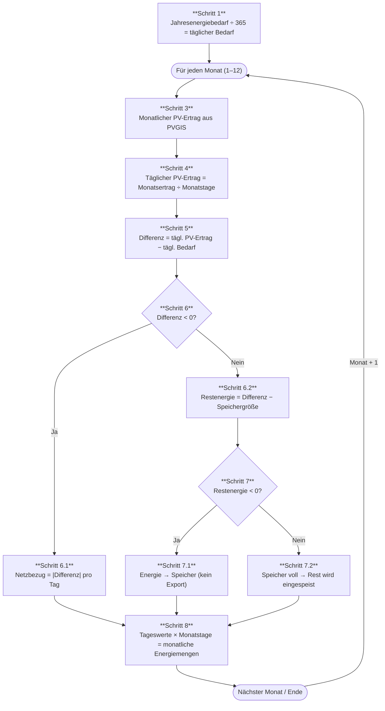

# Energiefluss-Algorithmus

Dieses Dokument beschreibt den Berechnungsalgorithmus für monatliche Energieflüsse in GGV/Mieter-Stromversorgungssystemen.

Implementierung: [`src/lib/energyFlowCalculation.ts`](../src/lib/energyFlowCalculation.ts)

---

## Überblick

Der Algorithmus berechnet in zwei Phasen, wie viel Energie pro Monat aus der PV-Anlage selbst verbraucht, im Speicher zwischengespeichert, ins Netz eingespeist oder aus dem Netz bezogen wird:

1. **Datenbeschaffung** – Monatliche PV-Erträge werden von der PVGIS-API abgerufen (EU-Satellitendaten). Bei fehlenden Koordinaten oder API-Fehler wird eine typische Monatsverteilung für Mitteleuropa als Fallback verwendet.
2. **Energieflussberechnung** – Für jeden der 12 Monate werden Tageswerte berechnet und auf die Monatstage hochgerechnet.

---

## Vereinfachende Annahmen

- Der Batteriespeicher wird als **täglicher Puffer** modelliert (Laden tagsüber, Entladen nachts). Dies ist eine plausible Näherung für Monatsbilanzierungen.
- **Kein saisonaler Übertrag** des Ladezustands zwischen den Monaten.
- Der tägliche Verbrauch ist **gleichmäßig über das Jahr** verteilt (kein saisonales Lastprofil).

---

## Algorithmus-Schritte



---

## Schritte im Detail

### Schritt 1 – Täglicher Energiebedarf

Der Jahresenergiebedarf wird aus allen Verbrauchergruppen summiert:

- Wohneinheiten × Verbrauch je Einheit × Beteiligungsquote
- Wärmepumpe (optional)
- E-Ladeinfrastruktur (optional, je Ladepunkt)
- Allgemeinverbrauch (optional)

```
täglicher Bedarf = Jahresenergiebedarf / 365
```

### Schritt 3 – Monatlicher PV-Ertrag

Der PV-Ertrag je Monat wird über die [PVGIS v5.2 API](https://joint-research-centre.ec.europa.eu/pvgis-photovoltaic-geographical-information-system_en) abgerufen (`/PVcalc`-Endpunkt). Die API liefert für jeden Monat den Wert `E_m` (monatlicher Energieertrag in kWh).

**Fallback:** Sind keine Koordinaten vorhanden oder schlägt die API fehl, wird eine typische Monatsverteilung für Mitteleuropa (basierend auf DWD-Daten) auf den geschätzten Jahresertrag (`kWp × 1000`) angewendet.

### Schritt 4 – Täglicher PV-Ertrag

```
täglicher PV-Ertrag = monatlicher PV-Ertrag / Tage im Monat
```

### Schritt 5 – Tägliche Energiebilanz

```
Differenz = täglicher PV-Ertrag − täglicher Bedarf
```

- **Differenz < 0** → PV-Defizit (Verbrauch übersteigt Erzeugung)
- **Differenz ≥ 0** → PV-Überschuss

### Schritt 6 – Defizit oder Überschuss?

| Bedingung | Folge |
|---|---|
| Differenz < 0 (Defizit) | Gesamte PV-Leistung wird direkt verbraucht; fehlende Energie wird aus dem Netz bezogen (Schritt 6.1) |
| Differenz ≥ 0 (Überschuss) | PV deckt den gesamten Bedarf; Überschuss steht für Speicher/Einspeisung bereit (Schritt 6.2) |

### Schritt 6.1 – Netzbezug bei Defizit

```
Netzbezug pro Tag = |Differenz|
Direktverbrauch   = täglicher PV-Ertrag
```

### Schritt 6.2 – Überschussverteilung

```
Restenergie = Differenz − Speicherkapazität
```

### Schritt 7 – Speicher oder Einspeisung?

| Bedingung | Folge |
|---|---|
| Restenergie < 0 | Überschuss passt vollständig in den Speicher; keine Netzeinspeisung (Schritt 7.1) |
| Restenergie ≥ 0 | Speicher ist voll; verbleibender Überschuss wird ins Netz eingespeist (Schritt 7.2) |

### Schritt 8 – Hochrechnung auf Monatswerte

```
monatliche Energiemenge = täglicher Wert × Tage im Monat
```

Dies ergibt für jeden Monat vier Energieflüsse:

| Feld | Beschreibung |
|---|---|
| `selfConsumptionKwh` | Direkter PV-Eigenverbrauch |
| `batteryChargeKwh` | In den Speicher geladene Energie |
| `gridExportKwh` | Ins Netz eingespeiste Energie |
| `gridSupplyKwh` | Aus dem Netz bezogene Energie |
